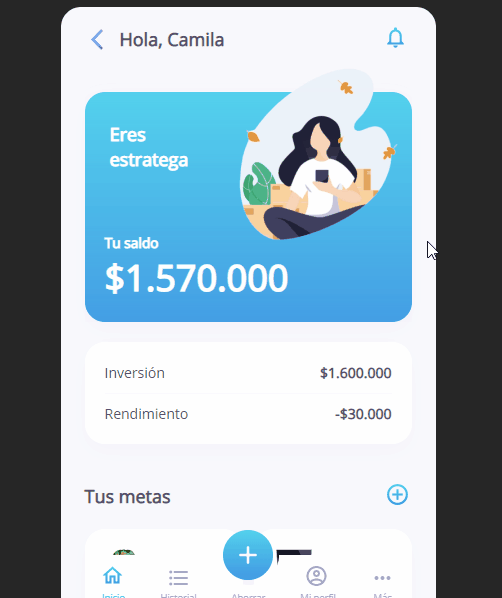

# Ahorro
Desarrollo Front del home, para una aplicación de Inversión

El desarrollo se puede visualizar en:
https://caaguirre194.github.io/Ahorro/

## Demo :clapper:

## Estructura del proyecto :open_file_folder:

* CSS:

Contiene todos los estilos .css que se aplican en el proyecto

* Images:

Contiene todas imágenes e iconos que posee el proyecto

Autor:
*  [GitHub](https://github.com/caaguirre194)
	 @caaguirre194
